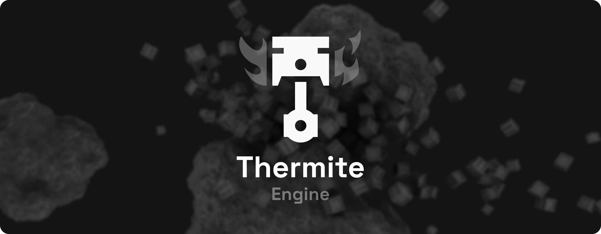

<h1 align="center">
    <div align="center">
        
    </div>
</h1>


<div align="center">
    <b>Thermite</b> - Destroy everything ray-traced <b>voxel</b> game engine!<br>
</div>

<br>

<div align="center">
    <a href="#tech-stack">Tech Stack</a>
    ·
    <a href="#getting-started">Getting Started</a>
    ·
    <a href="https://github.com/BredaUniversityGames/thermite/wiki">Wiki</a>
</div>

<br>

<h2><samp><b>Tech Stack</b></samp></h2>

- Modern C++20  
- [Graphite](https://github.com/mxcop/graphite) Render Graph *(Vulkan [SDK 1.4.328.1](https://sdk.lunarg.com/sdk/download/1.4.328.1/windows/vulkansdk-windows-X64-1.4.328.1.exe))*  
- CMake *(Build system)*

<h2><samp><b>Getting Started</b></samp></h2>

Open up the root folder inside your IDE, preferably Visual Studio or VSCode because they have cmake support built-in. 
Upon opening, CMake will automatically run and configure.

<h3><samp><b>Adding a new project</b></samp></h3>

To add a new project that automatically links against the engine static .lib, add a uniquely named folder inside ```projects/```, containing a ```main.cpp```. Reopen your IDE or reconfigure cmake inside your IDE to make it appear as a startup target. Select your project (the dropdown with the green play button, it will have the same name as the folder) and start coding with the thermite engine by including its headers.

<h3><samp><b>Selecting a configuration</b></samp></h3>

In VSCode and Visual Studio, you can select any of the following presets:

`Debug-Editor`, `Debug-Game`  
`Release-Editor`, `Release-Game`  
`RelWithDebInfo-Editor`, `RelWithDebInfo-Game`

These presets define:
- Supplied compiler flags.
- Whether to compile with debug info.
- Whether the editor is included.
- The values of the macros ```THERMITE_DEBUG``` and ```THERMITE_EDITOR```.
 